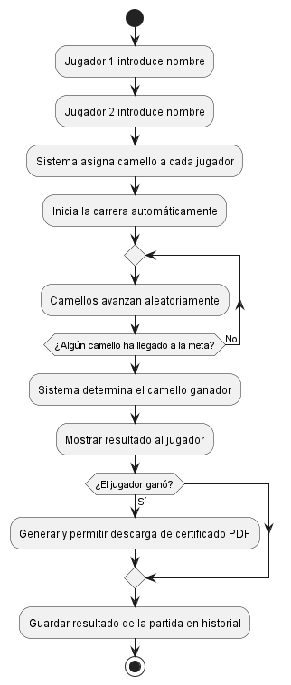

# **ANALISIS** 
## REQUISITOS FUNCIONALES 
- **Registrar jugadores**
- **Asignacion de camellos**
- **Iniciar/Ejecutar la carrera**
- **Determinar Ganador** 
- **Guardar recuento de partidas y resultados**

## REQUISITOS NO FUNCIONALES 
- **Interfaz grafica** 
- **Registrar jugadores con nombre**
- **Cuando los jugadores esten registrados comienza la carrera**
- **Conexion de los jugadores de manera simultanea para jugar(comprobarlo)**
- **Ejecucion de la carrera mediante el movimiento de los camellos**
- **Generar certificado en formato PDF al ganador** 
- **Guardar recuento de partidas y resultados en una BASE DE DATOS**

# PROTOTIPO
## INTERFAZ INICIO

## Diagrama de Actividad del Juego

