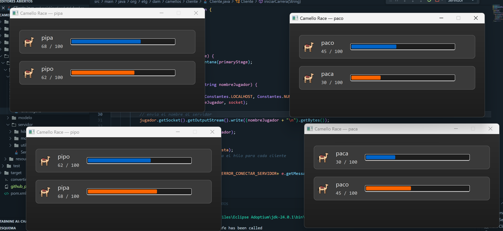

# **HITO 2**
## **ARQUITECTURA  Y DISEÑO**
- **En primer lugar, he identificado los sistemas del juego y a lo que se conectan:** 
1. **Sistema Cliente -> Permite a este registrarse -> Se conecta al servidor. **

2. **Sistema Servidor ->Se enctarga de todo el flujo de la aplicación, ejecuta la carrera y dicta el ganador.**

3. **Generador de PDF->Genera el certificado al ganador de la carrera mediante Docker. Se conecta al servidor**
4. **Historia del partidas->Guarda y muestra los resultados->Se conecta al servidor**

## DIAGRAMA DE COMPONENTES 

## COMPONENTES DEL SISTEMA: 
1. **GUI Jugador -> Interfaz grafica del jugador**
2. **Controlador Juego -> Controla el flujo general de la partida**
3. **Camellos -> Representa al camello y su posicion**
4. **Jugador -> Se guarda su nombre y se le asigna un camello**
5. **Carrera -> Gestiona turnos y detecta el ganador de la carrera**
6. **Historial Carreras -> Guarda y recupera los resultados de carreras anteriores**
7. **PDF Generator ->Crea el certificado PDF al ganador**

## **PRUEBAS**

- **Caso de uso  Ejemplo:**  poner texto nada mas 

**ID | Procedimiento | Entrada | Salida**
**01 | Registro de jugadores | "J1" y "J2" | Ambos registrados correctamente**
**02 | Movimiento de camellos | Carrera iniciada | Camellos avanzan automáticamente**
**03 | Determinar ganador | Camello 1 llega a la meta | Jugador 1 gana**
**04 | Generación del PDF | Jugador 1 gana | Se genera su certificado**
**05 | Recuento de partidas | Jugar 3 veces | El sistema guarda 3 resultados**